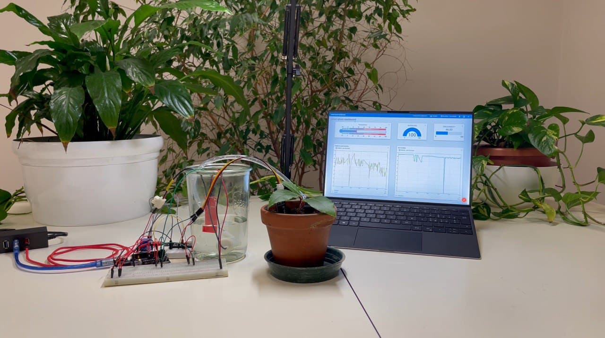
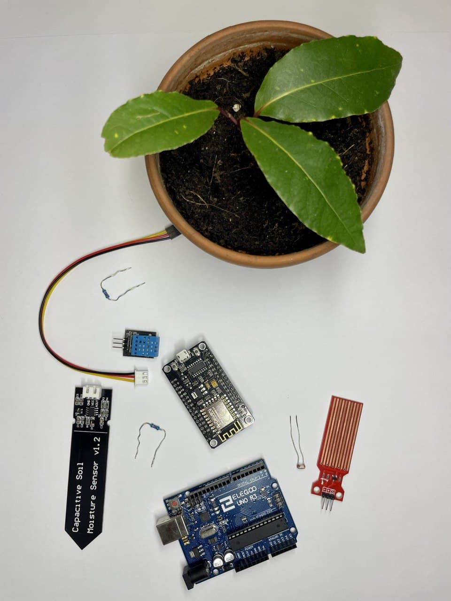
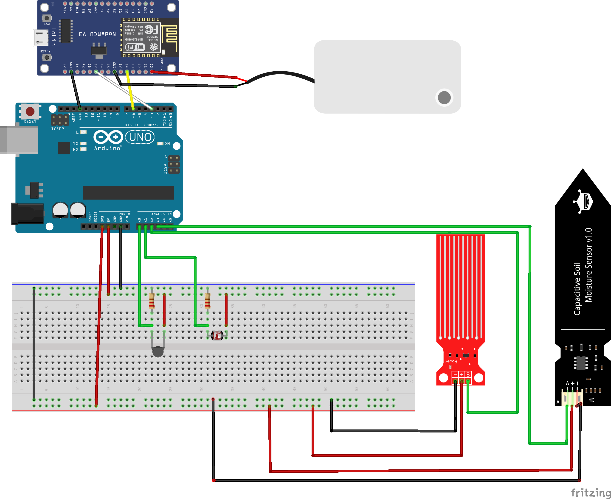

# Smart Plant IoT 🌱
This project was created by [@bottarocarlo](https://github.com/bottarocarlo) and [@cancianilorenzo](https://github.com/cancianilorenzo) for an assignment that we are currently completing for the project Embedded Software for the Internet of Things Unitn course 2021/2022
Having a plant requires taking care of it, which also includes water them daily. The problem occurs when you have to work around the clock, therefore you don’t have time and can forget to water the plant. To avoid this issue, we have created a system which waters them automatically.

## Hardware 🛠️

To build this system, we used:
- **1 [NodeMCU ESP8266]** IoT board which runs on the ESP8266 Wi-Fi SoC
- **1 [Arduino Uno]** development board used for analog input
- **1 [Soil Humdity sensor]** 
- **1 [Brightness sensor]** photoresistor💡 
- **1 [Temperature sensor]** thermistor🌡️ 
- **1 [Water level sensor]** 🌊
- **1 [3,3-5V water pump]** 💦
- **1 [5V Relè]**  
- **7 F-F Dupont cables**
- **1 micro USB cable**
- **1 USB charger**

plus:
- **1 glass jar** for the water
- **1 our little plant ina** common plant bought from Orvea

## Software 💻
Telegram API + Twitter + ThingsBoard

## Libraries📚
- **ESP8266WiFi**
- **TimeLib**
- **UniversalTelegramBot**
- **ArduinoJson**
- **NTPClient**
- **ThingsBoard**
- **SoftwareSerial**

## NodeMCU & ThingsBoard

## Circuit and wiring

### GPIO INFO --> D0 to D8
GPIO0: It oscillates and stabilizes HIGH after ~100ms. Boot Failure if pulled LOW  
GPIO1: LOW for ~50ms, then HIGH, Boot Failure if Pulled LOW.  
GPIO2: It oscillates and stabilize HIGH after ~100ms, Boot Failure if Pulled LOW.  
GPIO3: LOW for ~50ms, then HIGH.  
GPIO9: Pin is HIGH at Boot.  
GPIO10: Pin is HIGH at Boot.  
GPIO15: LOW, Boot failure if Pulled HIGH  
GPIO16: HIGH during Boot and Falls to ~1Volt.  

GPIO2 (D4 pin) if connected make the flash fail

## Linux
to run on usb port run firstly  
sudo chmod a+rw /dev/ttyUSB0  
don know why  
add to preferences: https://arduino.esp8266.com/stable/package_esp8266com_index.json  
add board libreries ESP8266  
add file .zip https://github.com/witnessmenow/Universal-Arduino-Telegram-Bot  
install from library manager arduinoJson, and select your board from tool > board  

https://github.com/amcewen/HttpClient/releases  

